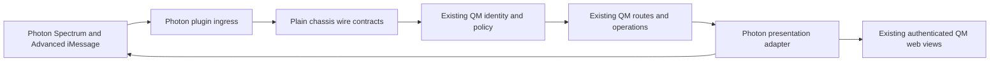

# QM iMessage additive architecture

## Boundary

Photon is an additive transport and presentation plugin. It receives provider events, normalizes them into plain chassis contracts, asks existing QM authority to identify and authorize the actor, invokes existing QM operations, and renders the result back through Photon. It does not own an agent loop, memory, queues, sessions, conversations, approvals, tools, sandboxes, prompts, models, or business records.

The `plugins/photon` package owns Photon-specific lifecycle, provider adaptation, receipt/checkpoint, message-binding, and delivery-operation ports. Durable implementations remain integration work owned by later lanes. Domain stores stay in QM. The plugin never imports `src/`; the only shared protocol seam is `plugins/chassis/src/photon-contract.ts`.

The `plugins/web-ui/src/photon/contracts.ts` contribution contract describes existing views and actions that an iMessage-oriented host may mount. It creates presentation metadata only. It does not duplicate storage, resource authorization, or view implementation.

## Source authentication and human identity

Source authentication proves that an HTTP request came from an allowed surface process and that its body was not modified or replayed. It does not prove which human sent an iMessage.

Human identity is resolved separately from the provider event actor and line/conversation context into QM's canonical identity. Authorization is then evaluated by QM for the exact actor, resource, resource revision, action, session, and conversation. An action binding is usable only by its bound actor before expiration and against the bound resource revision. A valid source-auth signature never upgrades, substitutes for, or bypasses that human authorization.

## Durable effect boundary

Provider event receipts are durably captured before acknowledgment and checkpointed only after successful processing. Outbound operations are reserved durably before provider dispatch. A confirmed provider message records message and message-part identity. A successful operation whose pinned SDK contract returns no message records `confirmed-no-message`. Dispatches whose result cannot be determined record `ambiguous` with a reconciliation key and are reconciled before any retry.

## Capability boundary

The foundation records what the pinned public declarations can represent. It does not assert that a configured iMessage provider supports every universal Spectrum builder. Unsupported and unverified capabilities remain explicit outcomes until a later lane proves the selected provider behavior. No live project, line, credential, message, delivery, read receipt, interaction, or device rendering is created by this foundation.
