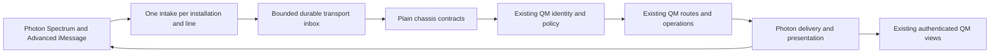

# QM iMessage additive architecture

## Boundary

Photon is an additive transport and presentation plugin. One authoritative Spectrum connection owns intake for each installation and line. It normalizes provider events into plain chassis contracts, asks existing QM to identify and authorize the actor, invokes existing QM behavior, and renders checked results through Photon. No messaging webhook is added as a substitute for that planned connection.

Existing QM remains authoritative for agent execution, memory, queues, sessions, conversations, approvals, tools, sandboxes, prompts, models, schedules, business records, and view data. Existing authenticated QM views remain the UI authority. The Photon web host mounts those views and contributes presentation metadata; it does not duplicate their stores or authorization.

## Owned implementation layers

- WT01 owns the trusted QM channel and preserves ordinary turn and internal redelivery behavior.
- WT02 owns actual Photon CLI login, project selection, assignment, and installation lifecycle.
- WT03 owns PostgreSQL-backed channel mechanics and grants for installation, inbox, checkpoints, bindings, delivery operations, polls, and card handles.
- WT04 owns the public pinned provider clients, Spectrum connection, subscriptions, recovery, and capability mapping.
- WT05 owns compatibility with existing QM routing, history, revisions, context, and destinations.
- WT06 owns the authenticated mini-app host over existing QM views.

Later lanes consume the frozen contracts for routing, intake, delivery, native features, views, packaging, and independent acceptance. The integration worktree owns only shared composition and canonical contracts after the foundation freeze.

## Identity and durability

Transport event IDs and provider message GUIDs are different identities. Provider, installation, line, conversation, message, and part scope is preserved structurally so equal provider IDs in two installations never collide. Lifecycle and other non-message events do not receive fabricated text, actor, conversation, or message fields.

The bounded durable inbox retains a normalized envelope or retrievable payload until durable QM handoff or rejection. It is not a second transcript or task queue. Claims are fenced; a sequenced success is marked checkpointed, or a sequenced rejection is recorded, in the same durable transition that advances its adjacent safe-integer line cursor. Outbound operations deduplicate by structured scoped logical idempotency, streamed text retains ordered chunks in a durable session before one provider send, and ambiguous provider outcomes reconcile before retry. PostgreSQL implementations remain WT03 work; the foundation defines and tests only contracts and fixtures.

## Security

Source authentication protects the plugin-to-core request. Human identity and policy remain separate QM decisions. Adapter delivery permissions and core-linking permissions remain separate. TypeScript ports narrow application access, while database grants form the eventual persistence security boundary.

## Evidence boundary

The foundation records what pinned public declarations and committed Photon documentation can represent. It does not implement provider adapters, PostgreSQL storage, CLI onboarding, production routes, or UI features. It creates no Photon account, project, installation, line, credential, message, delivery, receipt, interaction, or device rendering. Unsupported and ambiguous outcomes remain explicit.

## Checkpoint 1 repair integration

The repaired integration keeps one existing QM `App`, run store, delivery store, Slack core, agent loop, and web surface. A narrow core composition wraps the restricted ciphertext installation store, constructs the existing Photon authorization and core client against those QM objects, and forwards that exact client into the existing server dependencies. The migration registrar uses the privileged core pool; runtime stores are explicit dependencies and never receive that pool.

The provider composition resolves a scoped credential before SDK construction, acquires one durable physical-line lease, and constructs one connection. Spectrum intake reads the recoverable receipt store. Outbound dispatch uses the recoverable delivery store and a runtime-only progress callback before subsequent multipart writes. The adapter calls QM through the existing source-signed HTTP client. No second QM app, transcript, agent, queue, scheduler, or model loop is created.

Production activation is intentionally unavailable without a real canonical identity producer, Photon destination resolver, separate restricted database credentials, retained installation keyring, and source-signing configuration. Advanced intake remains unavailable. Static Photon route registration returns explicit unavailable responses when composition is absent; conditional route registration requires the separate server-table change recorded by R09. Structured Photon destination authority is not propagated through the orchestrator until the R06 cross-boundary blocker is resolved.
